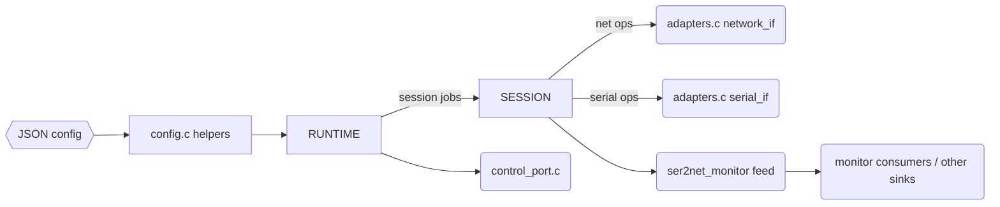
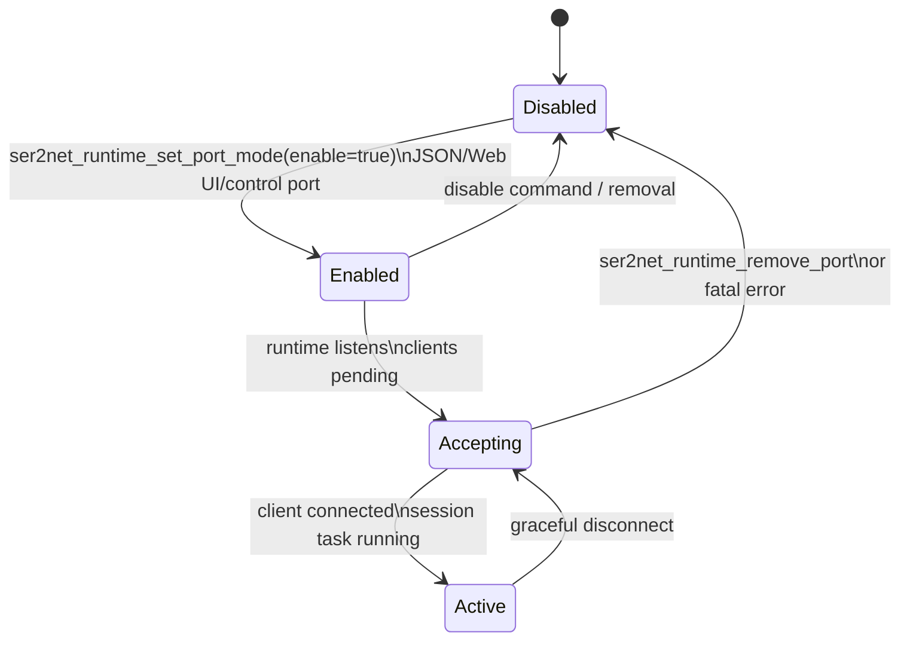
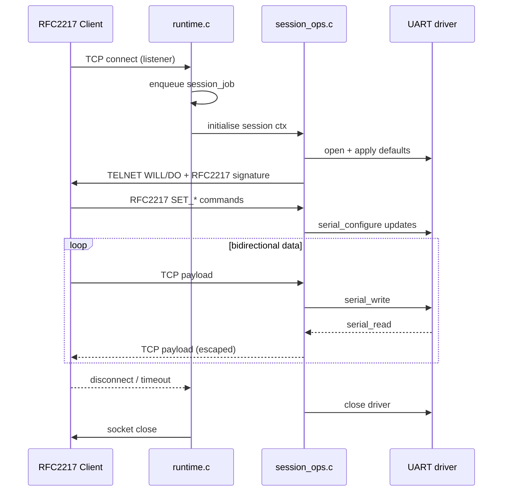

# ser2net MCU Library Overview

The `lib/ser2net_mcu` directory provides a compact, MCU-friendly rewrite of the
classic ser2net architecture.  The implementation is designed as a reusable
library that can be dropped into ESP-IDF or similar FreeRTOS-based projects.
Below is a quick tour of the modules and how they fit together.

## High-level workflow



1. `config.c` – exposes `ser2net_runtime_config_init()` and
   `ser2net_session_config_init()` helpers plus the simple `ser2net_start()` /
   `ser2net_stop()` façade.  Most firmware only needs to populate
   `struct ser2net_app_config` and call `ser2net_start()`.
2. `runtime.c` – orchestrates listener and session tasks, dynamic port
   management, and the optional control port callback wiring.  All network and
   UART access happens through adapter callbacks.
3. `session_ops.c` – bridges the runtime with the RFC2217 logic.  It maintains
   per-port defaults, active session bookkeeping, and applies serial parameter
   updates.
4. `adapters.c` – concrete ESP-IDF implementations for the abstract network and
   serial interfaces required by the runtime.
5. `control_port.c` – lightweight Telnet shell that mirrors the behaviour of
   the classic ser2net control port (`showport`, `showshortport`, etc.).
6. `json_config.c` – cJSON backed loader that translates embedded JSON into the
   adapter/runtime structures.
7. `security_store.c` – optional heap-backed vault that retains PEM material for
   TLS-enabled subsystems clients without bloating stack allocations.

### Port state machine

Every listener/serial pairing moves through a tiny lifecycle:



### Session handshake sequence



## Module summaries

### `runtime.c`

- Owns FreeRTOS resources (queues, listener/task handles, mutexes).
- Starts/stops the optional control port and tracks dynamic port additions.
- Public API lives in `runtime.h`.  Typical usage:
  1. Call `ser2net_runtime_config_init()`.
  2. Fill listener entries, provide adapter callbacks, set session hooks.
  3. Call `ser2net_runtime_start()`.

### `session_ops.c`

- Provides the default session handler used by the ESP32 example.
- Converts runtime callbacks into RFC2217 operations, keeps per-port defaults,
  and exposes helpers for configuration changes (`ser2net_session_update_defaults()` etc.).
- Publishes monitor frames for the control port, monitor consumer, or tests.

### `adapters.c`

- Implements `ser2net_network_if` and `ser2net_serial_if` using ESP-IDF sockets
  and UART driver APIs.
- Handles driver installation/removal when ports are added or removed at
  runtime.
- Central place to port the library to another MCU toolchain.

### `control_port.c`

- Implements a blocking Telnet-style shell that runs in its own task.
- Registers as a sink on the shared monitor bus
  (`ser2net_monitor_register_sink()` / `ser2net_monitor_feed()`) so the session
  layer can stream traffic to the operator or other backends (e.g. MQTT).

### `config.c`

- Thin façade that ties adapters, session handlers, and runtime together for
  convenience.  Used by `examples/esp32_rfc2217_gateway` to keep `app_main`
  concise.
- Mirrors API documentation directly in the C file for quick IDE discovery.

### `json_config.c`

- Parses the embedded `config.json` (or any provided JSON string) and produces
  ready-to-use structures for `ser2net_start()`.
- Reports human readable parser errors via `ser2net_json_last_error()`.
- Provides validation that matches what the Web UI expects.

### `security_store.c`

- Optional component enabled via `ENABLE_SECURITY_STORE`.
- Moves TLS PEM blobs (MQTT certs/keys) to the heap instead of the stack.
- Offers simple slot-based setters/getters so other modules can share material.

## Portability hooks

### Logging abstraction

The runtime no longer depends on ESP-IDF's `ESP_LOG*` macros directly.  All
logging goes through `lib/ser2net_mcu/include/ser2net_log.h`, which defines the
`SER2NET_LOGI/W/E` and `SER2NET_LOG_BUFFER_HEXDUMP` helpers.  Platform projects
can map those macros to their preferred backend, e.g.:

```c
#define SER2NET_USE_ESP_LOG 1
#include "ser2net_log.h"
```

When `SER2NET_USE_ESP_LOG` is not defined the library falls back to a tiny
`printf`-based shim so bare-bones targets or unit tests still get readable logs.

### OS shim

`lib/ser2net_mcu/include/ser2net_os.h` collects all task/queue/mutex/TLS calls
behind a single header.  The current implementation targets ESP-IDF's FreeRTOS
port, but other MCUs only need to provide equivalent wrappers for memory
allocation, task creation, delays, queues, critical sections, and (optionally)
thread-local storage.  The runtime/session/control code now consumes those
helpers exclusively, so platform-specific FreeRTOS headers stay confined to the
shim.

### Persistence callbacks

Dynamic builds typically allow the user to add/remove ports, tweak UART
parameters, or move the control port at runtime.  The core library does not
know how to write those changes back to flash or EEPROM, so
`ser2net_runtime_config` now accepts an optional
`struct ser2net_persist_ops` bundle:

```c
static BaseType_t save_ports(void *ctx,
                             const struct ser2net_esp32_serial_port_cfg *ports,
                             size_t count)
{
    return platform_write_ports_to_flash(ports, count) ? pdPASS : pdFAIL;
}

static const struct ser2net_persist_ops persist_ops = {
    .ctx = NULL,
    .load_ports = load_ports,
    .save_ports = save_ports,
    .load_control = load_control,
    .save_control = save_control
};

app_cfg.runtime_cfg.persist_ops = &persist_ops;
```

The runtime automatically calls `save_ports` / `save_control` whenever the
topology changes (control shell, REST API, Web UI, MQTT commands).  Loading is
optional and can be fed back into whatever config source the platform uses
(JSON, Kconfig, etc.) before calling `ser2net_start()`.  This keeps the library
flash-agnostic while still providing a consistent contract for MCU ports.

### Platform adapters

`ser2net_platform.h` selects the active platform (`SER2NET_TARGET`).  The
default is ESP32, which builds the implementations in
`src/platform/esp32/`.  Skeletons for STM32 and RP2040 live under their
respective directories so future ports only need to fill in the
`ser2net_network_if`/`ser2net_serial_if` factories.

## Build-time feature flags

The header `lib/ser2net_mcu/include/ser2net_opts.h` centralises compile-time
switches.  Projects may override them via compiler `-D` options before including
any ser2net headers.

| Macro | Default | Effect |
| --- | --- | --- |
| `ENABLE_DYNAMIC_SESSIONS` | `1` | Allow ports/sessions to be added or removed at runtime (JSON, Web API, control port, C API).  Set to `0` for static builds; JSON support is automatically disabled. |
| `ENABLE_CONTROL_PORT` | `1` | Compile the Telnet-style control port.  When disabled the symbols fall back to inline stubs. |
| `ENABLE_MONITORING` | `1` | Enable the control-port/Web monitoring feed.  Automatically disabled when the control port is omitted. |
| `ENABLE_SECURITY_STORE` | `1` | Allocate a heap-backed certificate vault used by TLS-enabled subsystems clients. |
| `ENABLE_WEB_SERVER` | `1` | (ESP32 example) Compile the embedded HTTP server/UI.  Mostly useful when reusing the library outside of ESP-IDF. |
| `ENABLE_JSON_CONFIG` | mirrors `ENABLE_DYNAMIC_SESSIONS` | Parse JSON configuration blobs.  Forced to `0` in static builds. |

### Static integration example

With `ENABLE_DYNAMIC_SESSIONS == 0` a firmware must describe its ports at
compile-time.  The snippet below shows the minimum steps:

```c
#include "ser2net_opts.h"
#include "runtime.h"
#include "adapters.h"

static const struct ser2net_esp32_serial_port_cfg static_ports[] = {
    {
        .port_id = 0,
        .uart_num = UART_NUM_1,
        .tx_pin = 17,
        .rx_pin = 16,
        .rts_pin = UART_PIN_NO_CHANGE,
        .cts_pin = UART_PIN_NO_CHANGE,
        .tcp_port = 4000,
        .tcp_backlog = 4,
        .baud_rate = 115200,
        .data_bits = UART_DATA_8_BITS,
        .parity = UART_PARITY_DISABLE,
        .stop_bits = UART_STOP_BITS_1,
        .flow_ctrl = UART_HW_FLOWCTRL_DISABLE,
        .mode = SER2NET_PORT_MODE_TELNET,
        .idle_timeout_ms = 0,
        .enabled = true
    }
};

struct ser2net_app_config app_cfg;
struct ser2net_esp32_serial_cfg serial_cfg = {
    .ports = static_ports,
    .num_ports = sizeof(static_ports) / sizeof(static_ports[0]),
    .rx_buffer_size = 512,
    .tx_buffer_size = 512
};
struct ser2net_esp32_network_cfg net_cfg = {
    .backlog = 4
};

ser2net_runtime_config_init(&app_cfg.runtime_cfg);
ser2net_session_config_init(&app_cfg.session_cfg);

for (size_t i = 0; i < serial_cfg.num_ports; ++i) {
    const struct ser2net_esp32_serial_port_cfg *p = &static_ports[i];

    struct ser2net_esp32_network_cfg listener = {
        .listen_port = p->tcp_port,
        .backlog = p->tcp_backlog > 0 ? p->tcp_backlog : net_cfg.backlog
    };

    const struct ser2net_network_if *net_if = ser2net_esp32_get_network_if(&listener);
    app_cfg.runtime_cfg.listeners[i].port_id = p->port_id;
    app_cfg.runtime_cfg.listeners[i].tcp_port = p->tcp_port;
    app_cfg.runtime_cfg.listeners[i].network = net_if;

    app_cfg.session_cfg.port_ids[i] = p->port_id;
    app_cfg.session_cfg.tcp_ports[i] = p->tcp_port;
    app_cfg.session_cfg.port_modes[i] = p->mode;
    app_cfg.session_cfg.port_params[i].baud = p->baud_rate;
    app_cfg.session_cfg.port_params[i].data_bits = 8;
    app_cfg.session_cfg.port_params[i].parity = 0;
    app_cfg.session_cfg.port_params[i].stop_bits = 1;
    app_cfg.session_cfg.port_params[i].flow_control = 0;
}

app_cfg.runtime_cfg.listener_count = serial_cfg.num_ports;
app_cfg.session_cfg.port_count = serial_cfg.num_ports;

ser2net_start(&app_cfg);
```

In static builds the JSON loader, REST mutators, and control-port commands for
`setport*` become read-only; monitoring can still be enabled separately via
`ENABLE_MONITORING`.

## Typical usage pattern

```c
struct ser2net_app_config app_cfg;
struct ser2net_esp32_serial_cfg serial_cfg;
struct ser2net_esp32_serial_port_cfg ports[CONFIG_PORT_LIMIT];
struct ser2net_esp32_network_cfg net_cfg;

ser2net_runtime_config_init(&app_cfg.runtime_cfg);
ser2net_session_config_init(&app_cfg.session_cfg);

if (ser2net_load_config_json_esp32(json_blob,
                                   &app_cfg,
                                   &net_cfg,
                                   &serial_cfg,
                                   ports,
                                   CONFIG_PORT_LIMIT) != pdPASS) {
    printf("Config error: %s\n", ser2net_json_last_error());
}

if (ser2net_start(&app_cfg) != pdPASS) {
    printf("Runtime start failed\n");
}
```

Once started, the runtime handles incoming TCP connections and delegates the
RFC2217 protocol handling to the session layer.  High-level code can dynamically
add or remove listeners through `ser2net_runtime_add_port()` and
`ser2net_runtime_remove_port()` or monitor activity using the control port or
REST API provided by the ESP32 example.

## Monitor bus & monitor consumer

Enabling `ENABLE_MONITORING` exposes a lightweight publish/subscribe bus:

```c
bool ser2net_monitor_register_sink(ser2net_monitor_sink_t sink, void *ctx);
void ser2net_monitor_unregister_sink(ser2net_monitor_sink_t sink, void *ctx);
void ser2net_monitor_feed(uint16_t tcp_port,
                          enum ser2net_monitor_stream stream,
                          const uint8_t *data,
                          size_t len);
```

The control port registers as a sink so operators can tail TELNET/TCP data.
Other components, such as the monitor consumer in `components/mqtt_client`, can
subscribe at the same time to forward monitor chunks to external systems.  The
ESP32 reference firmware publishes:

- `topic_base/state` (port inventory & session counters)
- `topic_base/cmd/disconnect` (drop misbehaving clients)
- `topic_base/monitor/<tcp>/<stream>` (hex-encoded monitor frames when enabled)

Disable `ENABLE_MONITORING` to drop the control-port monitor and MQTT relay in
a single build-time switch.


## JSON configuration schema (ESP32 example)

The embedded JSON configuration is parsed by `json_config.c`.  It accepts the
following top-level keys:

```json
{
  "sessions": { "max": 2, "stack_words": 4096, "priority": 4 },
  "buffers": { "net": 512, "serial": 512 },
  "serial": [
    {
      "uart": 2,
      "tx_pin": 17,
      "rx_pin": 16,
      "tcp_port": 4000,
      "tcp_backlog": 4,
      "baud": 115200,
      "data_bits": 8,
      "parity": "none",
      "stop_bits": 1,
      "flow_control": "none",
      "mode": "telnet",
      "idle_timeout_ms": 0,
      "enabled": true
    }
  ],
  "control": { "tcp_port": 4020, "backlog": 2 }
}
```

Field notes:

- `sessions` – Override task stack size, priority, and maximum concurrent
  sessions.  Values fall back to the defaults specified in `config.c`.
- `buffers` – Per-session buffer sizes in bytes.
- `serial` – Array of UART/TCP mappings.  Each entry must provide `uart`,
  `tx_pin`, `rx_pin`, and `tcp_port`; remaining fields (baud, framing,
  `tcp_backlog`, etc.) fall back to sensible defaults.  `port_id` values are
  assigned automatically in load order and do not need to appear in the JSON.
- `control` – Optional block to enable the text control port and configure its
  backlog.

The parser reports human readable errors via `ser2net_json_last_error()`.

## Control port commands

When the control port is enabled (`control.tcp_port` in the JSON), the classic
ser2net Telnet shell becomes available.  Supported commands include:

| Command | Description |
| --- | --- |
| `help` | List available commands. |
| `version` | Print firmware version string. |
| `showport [port]` | Detailed per-port information including current serial settings and session count. |
| `showshortport` | One-line summary per port. |
| `monitor <tcp|term> <port>` | Stream traffic from the TCP or terminal side.  Use `monitor stop` to exit. |
| `disconnect <tcp>` | Disconnect the active session bound to the given TCP port. |
| `setporttimeout <tcp> <seconds>` | Change idle timeout for a port. |
| `setportconfig <tcp> <tokens>` | Update defaults (baud, data bits, parity, stop bits, flow control, pins). Tokens follow the classic ser2net syntax (e.g. `115200 8DATABITS NONE 1STOPBIT +RTSCTS`) and may include uppercase pin tokens such as `UART2 TX17 RX16 RTS18 CTS19`. Prefix `-` disables a pin (`-TX`, `-RX`, `-RTS`, `-CTS`). If the TCP port does not exist yet, supplying `UARTn` plus at least one direction creates it on the fly. |
| `setportcontrol <tcp> <RTS|DTR tokens>` | Toggle modem control lines where supported. |
| `setportenable <tcp> <raw|rawlp|telnet|off>` | Change the port mode or disable the listener entirely. |
| `quit`/`exit` | Close the control port session. |

Unsupported features are hidden automatically; commands that depend on a
particular callback (e.g. adding ports) are disabled if the runtime was not
compiled with the required support.
